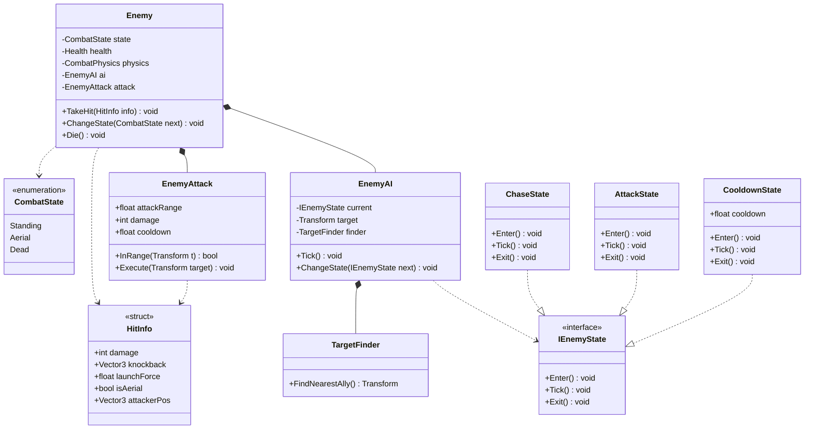

# 06. 몬스터(Enemy)

## 프리팹 내부 구조 (클래스 다이어그램)



## 스폰 / 초기화

### InitMonsterPrefebs
> 몬스터를 게임 키자마자 만들어둔다. (인게임 진입렉 저하)

- `ObjectPoolRoot`에 의해 실행 : 몬스터를 풀에 쌓아놓기 위해 몬스터 프리팹을 스테이지에 맞춰 미리 구성

### 인게임 출발
- `BattleSceneController`에 의해 몬스터가 **우측에서 기어나온다**

## 적 생성 (인게임)

씬 초기화 후, 적 등장부터 시작.

### 적 생성 루틴
- `Entity` 관리 및 `ObjectPoolRoot`에 몬스터 풀 생성까지

### 적 애니메이션/상태 그래프
```
진입 ──► Idle(기본) ⇄ 걷기

맞았을 때 (Any State, 맞으면 나오는 함수) ──► 피격
```
